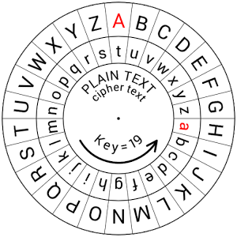
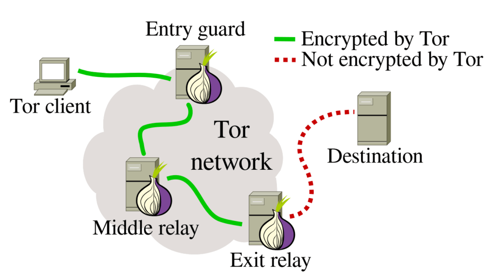

## The internet is not secure

The news lately has issued a steady stream of stories about breaches of internet security:
* Edward Snowden's disclosures of mass data collection and surveillance by the NSA
* Wikileaks CIA Spy tools disclosures
* Cloudbleed
* Dyn IoT DDoS attack
* [Spammergate/River City Media](https://mackeeper.com/blog/post/339-spammergate-the-fall-of-an-empire)
* [Dyn IoT DDoS attack](http://www.welivesecurity.com/2016/10/24/10-things-know-october-21-iot-ddos-attacks/)

When you're using the internet, your data pass through many computers, which are, in turn, connected to many other computers, and so on,
which leaves many points at which data may be exposed.

For every security measure that's invented, hackers quickly begin trying to find "exploits", or ways to circumvent those measures.

## What's Cybersecurity?

Wikipedia sez:
> Computer security, also known as cybersecurity or IT security, is the protection of computer systems from the theft or damage to the hardware, software or the information on them, as well as from disruption or misdirection of the services they provide.

In practice I'll provisionally say Cybersecurity is the practice of obscuring your data from persons other than yourself and your intended recipient(s). This is to say, keeping your communications private.
Data can be a message, metadata (ie who is writing whom when), webpage requests, user profiles, passwords, source code, and so on. Everything on a computer is data.

## Questions we might ask

How can we know that a person or 'place' is reliably found at a certain IP address? (SSL Certificates)  
Do we trust the security practices of the companies who hold our data? (LinkedIn plaintext passwords) 
Do we trust their decision making?  
What information do we choose to give them? 
How can we secure our own data? (Disk encryption, encrypted communications)

## Some solutions

Security researchers and software engineers have designed systems to obscure communications from point A to point B, where point A is the a trusted sender, and point B is the intended recipient of a message. It turns out, this is very complicated to do.

A central part of this, the "obscuring" part, is cryptography. Cryptography is a means by which to scramble a message in a reversible way, but only by means of a shared secret "key."

The simplest example:

In a simple caesar cipher, the shared secret is the number of ticks to turn the wheel to offset the alphabet.

Modern cryptographic algorithms are many orders of magnitude more complex and difficult to reverse, but follow the same basic principle. They have to be so difficult to reverse that it would take an extremely powerful computer an infeasible amount of time to do it. That's very requires a lot of complexity!

So first, we have to trust our encryption algorithm. There are a number of these kinds of algorithms for a variety of specific purposes. (Google SHA-1 Collision).

This leaves the question of how we securely share our secret key to recover the "plaintext" message from the "ciphertext" encoding:
* We could write it down in person.
* We could speak it over the phone, if we trust the phone lines.
* We could write it in an email if we trust our password is secure and we trust our email provider.

Over the internet, there are so many points of connection that it becomes very hard to trust that all of those points are secure, so transmitting a key for private communication creates a catch 22. 

Encrypted communications could only be as secure as the means of transmitting your secret key. 

Until 1976 when Whitfield Diffie and Roger Hellman invented Assymetric, or Public Key cryptography, a system whereby a shared public key allows two parties to encrypt communications without having to share their own private key. 
[Visual explanation of Public Key Cryptography](https://www.youtube.com/watch?v=YEBfamv-_do&feature=youtu.be&t=161)

Cryptography is also used in verifying identity and the integrity of data. When you create a password on a website, if they employ good security practices, the website doesn't store your password itself, but a cryptographic hash of the password. A hash function takes data of any size and returns a string of fixed length from which it is infeasible to infer the input, but given the same inputs, the hash function will always return the same output, but a small change to the inputs will produce large changes in the hash..

## Do we care about security?

There's a frequently cited straw-man argument that goes "But I have nothing to hide..."
Even if you feel there's nothing to be ashamed of in your behavior online or wherever, you do have things that you want to remain private - your email password, your bank account information. Essentially our online identity which allows us to communicate persistently on the internet. All of us in this room probably store some part of our identity online. 

But it's not just for ourselves that we want to employ secure communications, but to preserve and democratize the sphere of privacy. The more we all employ secure practices, because the internet is so interconnected, the more secure an internet we make for everybody.

## What tools can we use to provide greater security?

###TOR

A good example is TOR. TOR is an anonymizing network that uses relays and cryptography to conceal the identities behind and the contents of communications. When using the internet through the TOR network, your messages are passed from computer to computer within the network, with different parts encrypted at every node until it (potentially) exits the network from an "exit node" to its destination. None of the nodes along the path know where the message originated, its destination, and its contents.

The exit nodes have a special position, because they decrypt your message before passing it on to the "public internet." At this point, unless you're operating over a secure connection (https://), your message is unencrypted at this juncture, and could be intercepted by an exit node. They won't know the traffic's origin, but they will know its destination and its contents unless there's another layer of encryption between.

It's also said that TOR traffic receives special attention from the NSA's XKeyscore program. One response to this is to avoid TOR to avoid notice. Another would be to grow the network and provide increased security for everybody.

Things that operate over TOR:
* Normal web browsing
* Hidden services (like Silk Road)
* OnionShare
* Encrypted chat
* Secure Drop (Aaron Swartz)

### HTTPS

So what is HTTPS? HTTPS is a layer that sits on top of HTTP. It ensures that the website you're accessing matches the URL that you typed into your browser by means of a [Certificate](https://en.wikipedia.org/wiki/Public_key_certificate), and encrypts all of the data passed between your browser and the website, so that your communications are protected from eavesdroppers.

### VPN

VPN stands for "Virtual Private Network." A VPN is a private network (like your home wifi network or an institution's internal network) that connects to the public internet, so the origins of requests made through VPNs aren't visible to the websites or anybody outside of the private network, instead seeming to originate from the VPN. VPNs are often privately operated for internal use, or paid services, though free options exist, such as [TunnelBear](https://www.tunnelbear.com/).

### Two Factor Authentication (2FA)

* Something you know: the name of your favorite elementary school teacher, your first pet
* Something you have: ie a text sent to your phone, an application with a private key on your phone. 
* Something you are: ie your thumbprint, your retina, voice recognition, other biometric data

### Passwords

Tim Berners-Lee's recent [projects](https://solid.mit.edu/#home) and [opinions](https://www.theguardian.com/technology/2017/mar/11/tim-berners-lee-web-inventor-save-internet).