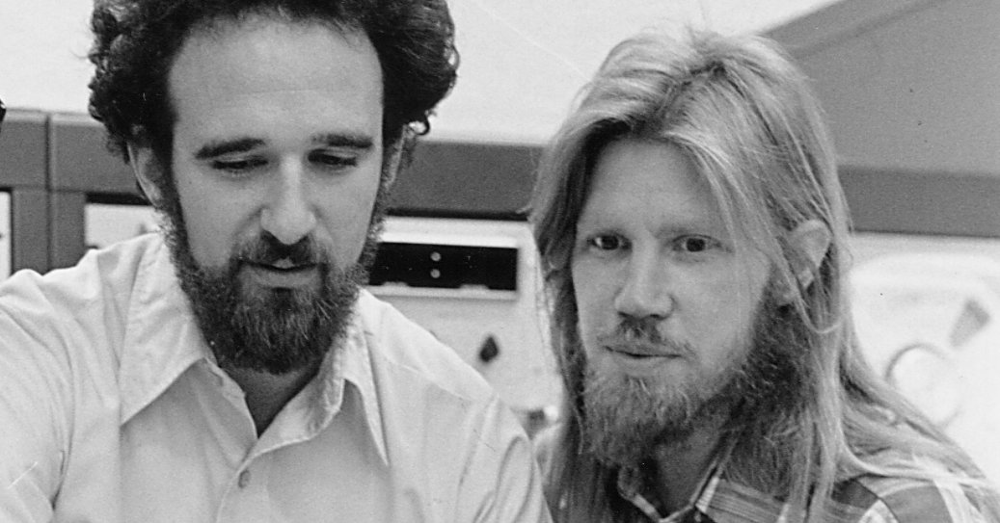

# Asymmetric Cryptography aka Public Key Cryptography

## Invented 1976 by Whitfield Diffie and Roger Hellman

[Visual explanation of Public Key Cryptography](https://www.youtube.com/watch?v=YEBfamv-_do&feature=youtu.be&t=161)